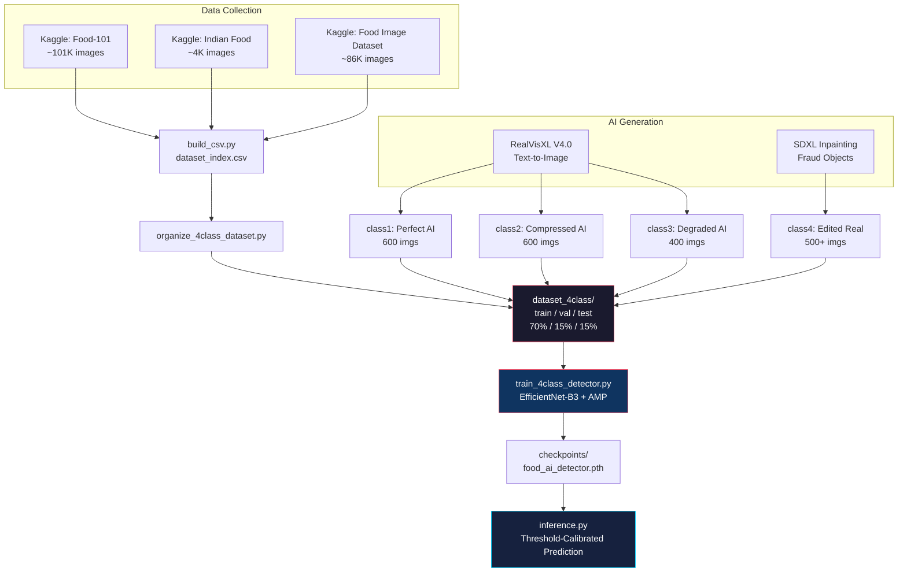
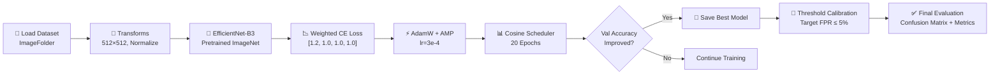
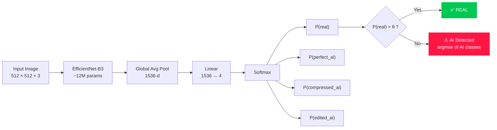
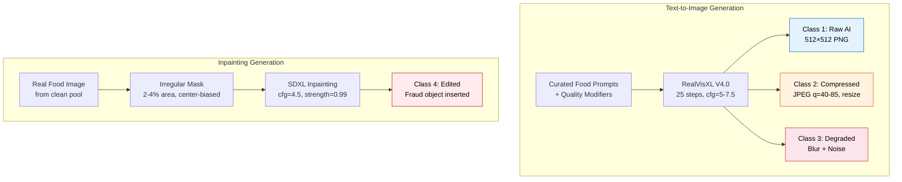
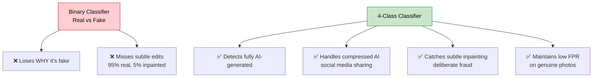
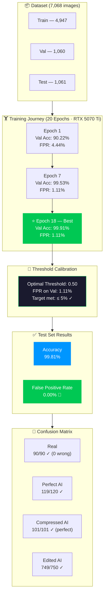

<p align="center">
  <h1 align="center">🛡️ FoodGuard</h1>
  <p align="center"><b>AI-Powered Food Fraud Detection System</b></p>
  <p align="center">
    Detect AI-generated, compressed, and tampered food images using deep learning forensics.
  </p>
</p>

<p align="center">
  
  
  
  
  
</p>

---

## 📌 Overview

**FoodGuard** is a 4-class deep learning system that classifies food images as:

| Class | Description |
|-------|-------------|
| 🟢 **Real** | Genuine, unedited food photographs |
| 🔴 **Perfect AI** | High-quality AI-generated food images (no post-processing) |
| 🟡 **Compressed AI** | AI-generated images degraded by JPEG compression & resizing |
| 🟠 **Edited AI** | Real images tampered via AI inpainting (e.g., cockroach, mold inserted) |

> **Goal:** Achieve ≤ 5% False Positive Rate — genuine food photos must NOT be wrongly flagged.


## 🏗️ System Architecture



---

## 🔬 Training Pipeline



---

## 🧬 Model Architecture



---

## 🗂️ Project Structure

```
FoodGuard/
├── config/
│   └── category_mapping.yaml      # Food category mapping
├── src/
│   ├── data/
│   │   ├── dataset_loader.py      # Generic food dataset loader
│   │   ├── detector_dataset.py    # 4-class detector dataset
│   │   ├── augmentations.py       # Training transforms
│   │   └── ela.py                 # Error Level Analysis (forensic)
│   └── models/
│       ├── food_classifier.py     # Base food classifier
│       ├── dual_stream_detector.py# RGB + FFT dual-stream model
│       ├── focal_loss.py          # Focal Loss implementation
│       └── trainer.py             # Training loop manager
├── scripts/
│   ├── build_csv.py               # Build master dataset CSV
│   ├── build_detector_csv.py      # Build 4-class detector CSV
│   ├── organize_4class_dataset.py # Organize into train/val/test
│   ├── generate_ai_images.py      # AI food image generation (SDXL)
│   ├── generate_fraud_inpainting.py # Fraud object inpainting
│   ├── generate_fraud_simple.py   # Overlay-based fraud fallback
│   └── validate_csv.py            # Dataset validation checks
├── train_4class_detector.py       # 🚀 Main training script
├── evaluate.py                    # Model evaluation & metrics
├── inference.py                   # Single-image inference
├── requirements.txt               # Python dependencies
└── README.md
```

---

## 🚀 Quick Start

### 1. Install Dependencies

```bash
pip install -r requirements.txt
```

### 2. 🪄 Run the Web App (Easiest Way!)

You don't need to train the model to try it! Just download the repository, run the Streamlit app, upload a food photo, and watch the forensic AI do its magic ✨.

```bash
streamlit run app.py
```

It will automatically load the best trained model. You can drag & drop images directly into your browser to see real-time forensic analysis, including Grad-CAM explainability and Error Level Analysis (ELA) bounding boxes.

### 3. Run Inference (Command Line)

If you prefer the terminal:

```bash
python inference.py path/to/food_image.jpg
```

### 4. Build Dataset & Train (For Developers)

If you want to train the model yourself or generate more AI images, you will use the files in the `scripts/` folder.

**Image Generation Scripts:**
All AI image generation happens in the `scripts/` directory. If you want to generate your own fake food images, use scripts like `generate_ai_images.py` and `generate_fraud_inpainting.py`.

**Prepare Data & Train:**
```bash
# Build unified CSV and organize datasets
python scripts/build_csv.py
python scripts/organize_4class_dataset.py

# Run training (uses AMP automatically)
python train_4class_detector.py
```

Checkpoints will be saved to `checkpoints/food_detector/`.

**Sample Output (Inference):**

```
============================================================
Image: test_burger.jpg
============================================================
Prediction:  REAL
Confidence:  94.32%
Is Fake:     NO

Class Probabilities:
  real           :  94.32% █████████████████████████████████████████████
  perfect_ai     :   3.21% █
  compressed_ai  :   1.87% 
  edited_ai      :   0.60% 
============================================================
```

---

## 🎯 AI Image Generation

FoodGuard generates its own training data using **RealVisXL V4.0** (`SG161222/RealVisXL_V4.0`):



**Fraud Objects:** cockroach, housefly, mosquito, bee, ant, worm, human hair, mold, plastic fragment, paper piece, metal shard.

---

## 📊 Data Sources

> ⚠️ **Note:** Due to GitHub's file size limits, the actual image datasets are **NOT** included in this repository. 
> 
> 🔗 **[Download the AI-Generated Fake Food Dataset here (Kaggle / Google Drive)]** *(Link to be added)*

| Dataset | Source | Images | Cuisine Coverage |
|---------|--------|--------|-----------------|
| **Food-101** | Kaggle (ETH Zurich) | ~101,000 | Western, International |
| **Indian Food Dataset** | Kaggle | ~4,000 | Indian (biryani, paneer, etc.) |
| **Food Image Dataset** | Kaggle (UECFOOD256 + AIcrowd) | ~86,000 | Japanese, Mixed |
| **AI-Generated** | *See link above* | ~2,000 | Multi-cuisine |
| **AI-Inpainted Fraud** | *See link above* | ~550 | Multi-cuisine |

**Total Real Images:** ~191,000+ &nbsp;|&nbsp; **Sampled for Training:** 5,000 (balanced prototype)

---

## ⚙️ Training Configuration

| Parameter | Value | Rationale |
|-----------|-------|-----------|
| **Backbone** | EfficientNet-B3 | Best accuracy-per-param; fits 12GB VRAM |
| **Image Size** | 512 × 512 | Preserves forensic artifacts vs 224×224 |
| **Batch Size** | 16 | Max for 512×512 on 12GB |
| **Optimizer** | AdamW | Better weight decay for fine-tuning |
| **Learning Rate** | 3e-4 | Standard for timm fine-tuning |
| **Scheduler** | Cosine Annealing (T=20) | Smooth decay, no sudden drops |
| **Loss** | Cross-Entropy | Weights: [1.2, 1.0, 1.0, 1.0] — penalizes FP on real |
| **AMP** | Enabled | ~2× speed, ~40% less VRAM |
| **Epochs** | 20 | With early stopping |
| **Target FPR** | ≤ 5% | Calibrated via threshold sweep |

---

## 🧪 Why 4 Classes, Not Binary?



---

## 📈 Training Results



---

## 🗺️ Roadmap

- [x] Real food data collection (3 Kaggle datasets, ~191K images)
- [x] AI image generation pipeline (RealVisXL V4.0)
- [x] Fraud inpainting pipeline (SDXL Inpainting)
- [x] Data processing & 4-class organization
- [x] Training script with AMP and threshold calibration
- [x] DGX Kubernetes Training Pipeline Setup (PVC, MIG GPU)
- [x] Executed model training on DGX Server
- [x] Threshold calibration for ≤5% FPR
- [x] Evaluation (confusion matrix, per-class metrics)
- [ ] Grad-CAM explainability visualization (Planned)
- [ ] Dual-stream model (RGB + FFT frequency analysis) (Planned)
- [ ] REST API deployment (FastAPI) (Planned)

---

## 🔧 Tech Stack

| Technology | Purpose |
|-----------|---------|
| **PyTorch** | Deep learning framework |
| **timm** | EfficientNet model zoo |
| **HuggingFace Diffusers** | SDXL text-to-image & inpainting |
| **RealVisXL V4.0** | Photorealistic image generation |
| **scikit-learn** | Metrics & evaluation |
| **Pillow** | Image I/O and processing |
| **xformers** | Memory-efficient attention for SDXL |
| **CUDA AMP** | Mixed-precision training |
| **matplotlib / seaborn** | Visualization |

---

## 🌍 Real-World Applications

- **Food Delivery Apps** — Detect fraudulent complaint images (fake contaminants for refunds)
- **Restaurant Reviews** — Filter AI-manipulated food photos
- **Food Safety Agencies** — Verify authenticity of food complaint evidence
- **Social Media** — Flag AI-generated food content for transparency

---

## 👥 Team

| Member | Role |
|--------|------|
| **Raj** | Architecture, AI generation, training pipeline, inference |
| **Rahul** | Data validation, category mapping, evaluation scripts |
| **Aman** | Dataset management, augmentation testing, dual-stream model |

---

<p align="center">
  <b>Project</b><br/>
  Built with 🔬 PyTorch and ☕ caffeine
</p>
