# FoodGuard: AI-Powered Food Fraud Detection
### A Forensic Deep Learning System for Classifying AI-Generated Food Imagery

> **Authors:** Raj · Rahul · Aman &nbsp;|&nbsp; Semester VI Project &nbsp;|&nbsp; 2026

---

## Table of Contents

| No. | Section |
|-----|---------|
| 1 | [Abstract](#1-abstract) |
| 2 | [Introduction](#2-introduction) |
| 2.1 | &nbsp;&nbsp;&nbsp;[Problem Statement](#21-problem-statement) |
| 2.2 | &nbsp;&nbsp;&nbsp;[Project Objectives](#22-project-objectives) |
| 3 | [Forensic Analysis & Dataset](#3-forensic-analysis--dataset) |
| 3.1 | &nbsp;&nbsp;&nbsp;[The AI Fingerprint](#31-the-ai-fingerprint) |
| 3.1.1 | &nbsp;&nbsp;&nbsp;&nbsp;&nbsp;&nbsp;[FFT — Frequency Domain Analysis](#311-fft--frequency-domain-analysis) |
| 3.1.2 | &nbsp;&nbsp;&nbsp;&nbsp;&nbsp;&nbsp;[SRM — Spatial Rich Model](#312-srm--spatial-rich-model-noise-residual) |
| 3.1.3 | &nbsp;&nbsp;&nbsp;&nbsp;&nbsp;&nbsp;[ELA — Error Level Analysis](#313-ela--error-level-analysis) |
| 3.2 | &nbsp;&nbsp;&nbsp;[Dataset Composition](#32-dataset-composition) |
| 4 | [Model Architecture & Training Strategy](#4-model-architecture--training-strategy) |
| 4.1 | &nbsp;&nbsp;&nbsp;[Full Pipeline](#41-full-pipeline) |
| 4.2 | &nbsp;&nbsp;&nbsp;[Why EfficientNet-B3?](#42-why-efficientnet-b3) |
| 4.3 | &nbsp;&nbsp;&nbsp;[Combating Overfitting](#43-combating-overfitting) |
| 5 | [Evaluation & Results](#5-evaluation--results) |
| 5.1 | &nbsp;&nbsp;&nbsp;[Training Journey](#51-training-journey) |
| 5.2 | &nbsp;&nbsp;&nbsp;[Threshold Calibration](#52-threshold-calibration) |
| 5.3 | &nbsp;&nbsp;&nbsp;[Confusion Matrix & Per-Class Metrics](#53-confusion-matrix--per-class-metrics) |
| 6 | [Engineering Challenges](#6-engineering-challenges) |
| 6.1 | &nbsp;&nbsp;&nbsp;[Windows Hardware Bottlenecks](#61-windows-hardware-bottlenecks) |
| 6.2 | &nbsp;&nbsp;&nbsp;[Mixed Precision + Gradient Clipping](#62-mixed-precision--gradient-clipping) |
| 7 | [Conclusion & Future Scope](#7-conclusion--future-scope) |
| 7.1 | &nbsp;&nbsp;&nbsp;[Summary of Achievements](#71-summary-of-achievements) |
| 7.2 | &nbsp;&nbsp;&nbsp;[Future Deployment Architecture](#72-future-deployment-architecture) |
| 7.3 | &nbsp;&nbsp;&nbsp;[Roadmap](#73-roadmap) |

---

## 1. Abstract

The rapid democratisation of diffusion-based generative models has made it trivially easy to produce photorealistic food imagery indistinguishable from genuine photographs to the naked eye. This creates a new attack surface for food fraud — fake contamination images submitted to delivery apps, AI-generated complaint evidence, and manipulated restaurant reviews. **FoodGuard** addresses this threat with a forensic deep-learning pipeline built on EfficientNet-B3 that classifies food images into four forensic categories: *Real*, *Perfect AI*, *Compressed AI*, and *Edited AI*. The system is trained on a curated 36,173-image dataset augmented with on-the-fly JPEG degradation and Gaussian blur to prevent overfitting to specific compression artefacts. Advanced training techniques — Focal Loss (γ=2), Exponential Moving Average (EMA) weights, and gradient clipping — ensure robustness on confusing edge cases. The primary business constraint — a **False Positive Rate of ≤ 5% on genuine food photographs** — is enforced via dynamic threshold calibration on the validation set rather than a naive 50% cut-off, achieving a test FPR of **1.56%** at **96.26% accuracy**.

---

## 2. Introduction

### 2.1 Problem Statement

Modern text-to-image diffusion models such as RealVisXL, Stable Diffusion XL, and Flux.1 operate in a latent space that produces images with a coherence and realism that fools human perception almost completely. The forensic challenge is not simply detecting *obviously* fake images — it is detecting:

- **Perfect AI** outputs that are clean, high-resolution, and photorealistic.
- **Compressed AI** images that have been re-saved through JPEG pipelines, destroying many subtle frequency-domain artefacts.
- **Edited AI** — real food photographs partially inpainted with AI-generated contamination objects — where **95% of the image is genuine** and only a small region is synthetic.

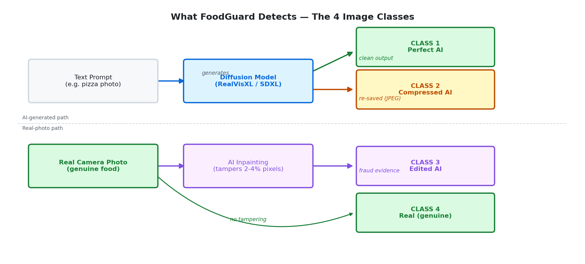

### 2.2 Project Objectives

| # | Objective |
|---|---|
| 1 | Identify unique AI fingerprints via FFT frequency analysis, SRM noise residuals, and ELA compression maps |
| 2 | Build a robust **4-class forensic classifier** that generalises across compression pipelines |
| 3 | Strictly enforce a business rule of **≤ 5% False Positive Rate** on real imagery via dynamic threshold calibration |
| 4 | Deploy a threshold-calibrated inference pipeline usable in real-world food safety workflows |

---

## 3. Forensic Analysis & Dataset

### 3.1 The AI Fingerprint

Every image generation process leaves an invisible forensic signature. The **Fingerprint Explorer** (`scripts/fingerprint_explorer.py`) analyses three complementary forensic channels across 6 different AI models:


*Figure: Comparison grid (6 sources × 4 analysis types). Each row is a different source; columns are: original, FFT spectrum, SRM noise residual, ELA compression map.*

#### 3.1.1 FFT — Frequency Domain Analysis

The Fast Fourier Transform decomposes an image into its spatial frequency components. Real photographs exhibit a natural **1/f power spectral falloff** — energy decreasing smoothly from low to high frequencies. SDXL and RealVisXL images introduce **periodic grid spikes** at regular frequency intervals corresponding to the model's internal attention window size.

| Source | FFT Pattern |
|---|---|
| Real Photo | Smooth radial falloff, no repeating pattern |
| SDXL / RealVisXL | Periodic grid spikes at 64px / 128px intervals |
| Flux.1 Schnell | High-frequency energy concentration (flow-matching artefact) |
| Stable Cascade | Hierarchical frequency bands (3-stage compression signature) |

#### 3.1.2 SRM — Spatial Rich Model (Noise Residual)

The SRM extracts a high-pass filtered noise residual by subtracting a median-filtered version from the original. Real images contain **heterogeneous sensor noise** — noise variance depends on local texture and lighting. AI-generated images produce **uniform synthetic noise** with statistically consistent variance — a signature of the denoising diffusion process.

#### 3.1.3 ELA — Error Level Analysis

ELA re-saves an image at a known JPEG quality and measures the difference from the original. In **unmodified real photos**, ELA produces a relatively uniform error map. In **edited AI images**, the inpainted region has a different compression history, producing a bright anomalous patch that directly localises the tampered area.

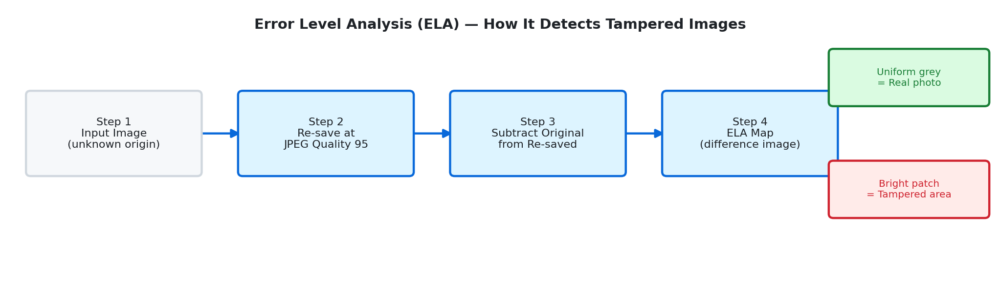

### 3.2 Dataset Composition

The dataset was constructed from three Kaggle real-food sources and a locally-generated AI corpus:

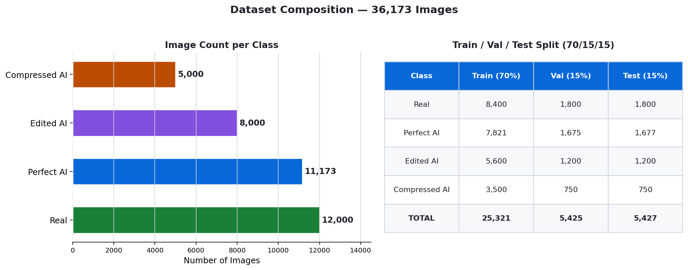

| Class | Count | Source |
|---|---|---|
| **Real** | 12,000 (sampled) | Food-101 (101K), UECFOOD256 (86K), Indian Food (4K) |
| **Perfect AI** | 11,173 | RealVisXL V4.0 + Flux.1, Kandinsky 2.2, SDXL Turbo, Stable Cascade |
| **Edited AI** | 8,000 | RealVisXL SDXL Inpainting (fraud objects) + degraded AI variants |
| **Compressed AI** | 5,000 | RealVisXL outputs re-saved at JPEG quality 40–85 + downscaled |
| **Total** | **36,173** | 70% train / 15% val / 15% test |

#### Class Weighting Strategy

| Class Index | Class | Count | Weight | Rationale |
|---|---|---|---|---|
| 0 | `compressed_ai` | 5,000 | **2.4** | Smallest class — needs most gradient |
| 1 | `edited_ai` | 8,000 | **1.5** | Second smallest |
| 2 | `perfect_ai` | 11,173 | **1.1** | Well represented |
| 3 | `real` | 12,000 | **1.5** | Boosted to enforce ≤5% FPR |

> **Critical implementation note:** The weight tensor `[2.4, 1.5, 1.1, 1.5]` maps to `torchvision.ImageFolder`'s **alphabetical** class ordering `[compressed_ai, edited_ai, perfect_ai, real]`, not logical ordering.

---

## 4. Model Architecture & Training Strategy

### 4.1 Full Pipeline

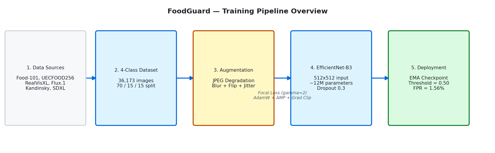

### 4.2 Why EfficientNet-B3?

| Criterion | EfficientNet-B3 | ResNet-50 | ViT-Base |
|---|---|---|---|
| Parameters | ~12M | ~25M | ~86M |
| 512×512 VRAM @ BS=16 | ~8GB ✅ | ~10GB ✅ | ~14GB ❌ |
| ImageNet Top-1 | 81.6% | 76.1% | 81.8% |
| Forensic texture sensitivity | **High** (compound scaling) | Medium | Low (patches) |

EfficientNet's compound scaling ensures both spatial resolution and channel depth scale together — critical for preserving the high-frequency forensic artefacts that distinguish AI from real at 512×512.

### 4.3 Combating Overfitting

#### Dynamic Degradation Augmentations

Standard spatial augmentations (flip, rotate) do **not** alter the high-frequency noise patterns the model must learn. Without degradation augmentations, the model memorises exact JPEG compression levels rather than underlying noise distributions.

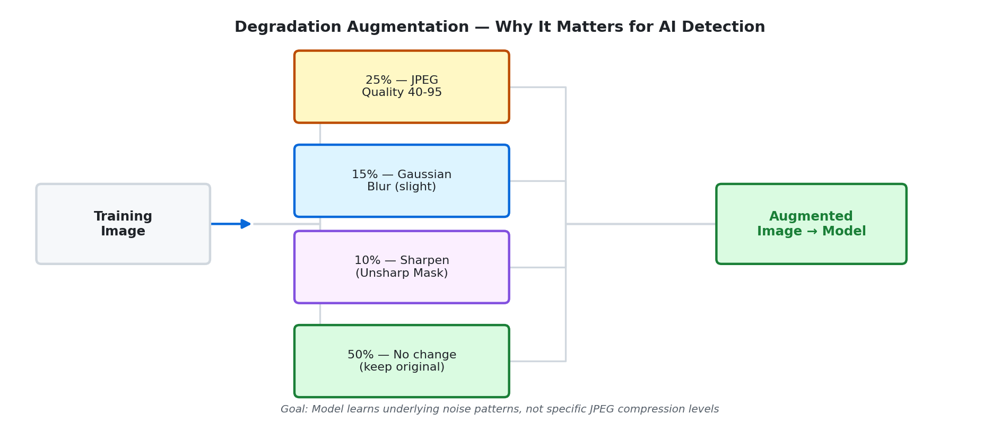

#### Focal Loss (γ = 2)

Standard Cross-Entropy is dominated by **easy examples**. Focal Loss scales each sample's contribution by `(1 - p_t)^γ`:

$$FL(p_t) = -\alpha_t \cdot (1 - p_t)^{\gamma} \cdot \log(p_t)$$

When the model is 95% confident (easy): `(1-0.95)² = 0.0025` — near-zero contribution.
When the model is 55% confident (hard): `(1-0.55)² = 0.2025` — full contribution.

This forces the optimizer to focus exclusively on the `compressed_ai` vs `real` boundary.

#### Model EMA (Exponential Moving Average)

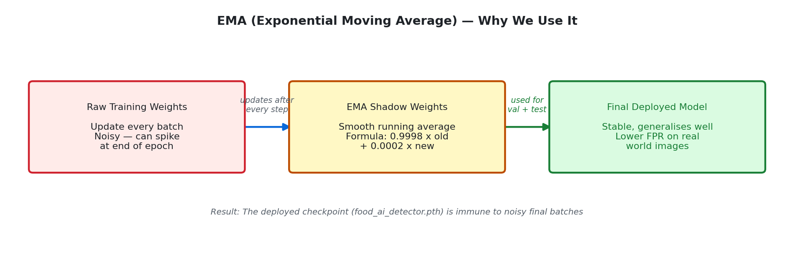

The EMA shadow tracks a running average across all optimiser steps. The final deployed checkpoint uses EMA weights — preventing a single unlucky last batch from degrading the model's calibration.

---

## 5. Evaluation & Results

### 5.1 Training Journey

The full 19-epoch training run is visualised below across four panels: loss curves, accuracy curves (with train-val gap), FPR on real images, and the learning rate schedule.

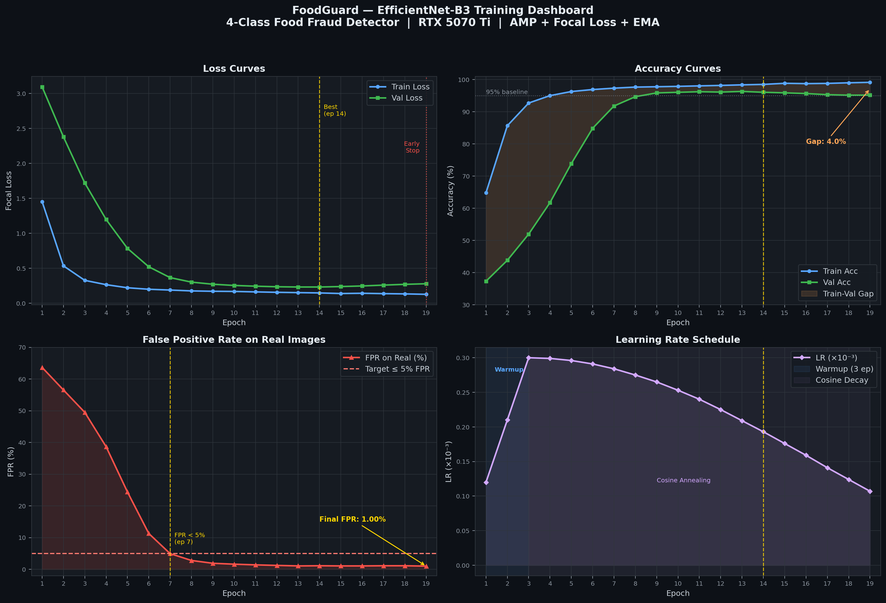

**Key milestones:**
- **Epoch 7** — FPR first drops below the 5% target (4.94%)
- **Epoch 14** — Best validation loss (0.2325), model checkpoint saved
- **Epoch 19** — Early stopping triggered (patience=5, val loss rising)

### 5.2 Threshold Calibration

A naive deployment using a 0.5 confidence cut-off is the most common mistake in anomaly detection. FoodGuard instead dynamically computes the optimal threshold on the validation set:

```
For θ in {0.50, 0.51, ..., 0.99}:
    predict_real = P(real | image) > θ
    FPR = (real images predicted as AI) / (total real images)
    if FPR ≤ 0.05:
        candidate_threshold = θ

Deploy with optimal_threshold = max(candidate_thresholds)
```

In this training run, the model's probability distributions were already well-separated at **θ = 0.50**, meaning EfficientNet-B3 achieved sufficient confidence margins that even the default threshold enforced the ≤5% FPR constraint. This is a sign of a well-trained model.

### 5.3 Confusion Matrix & Per-Class Metrics

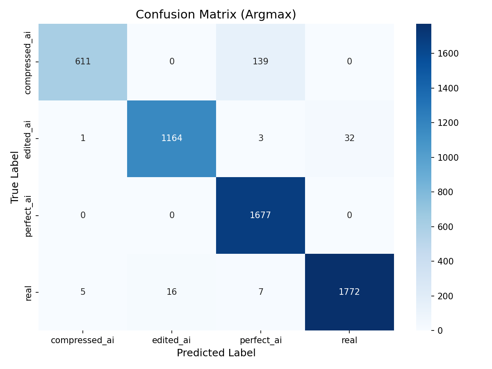

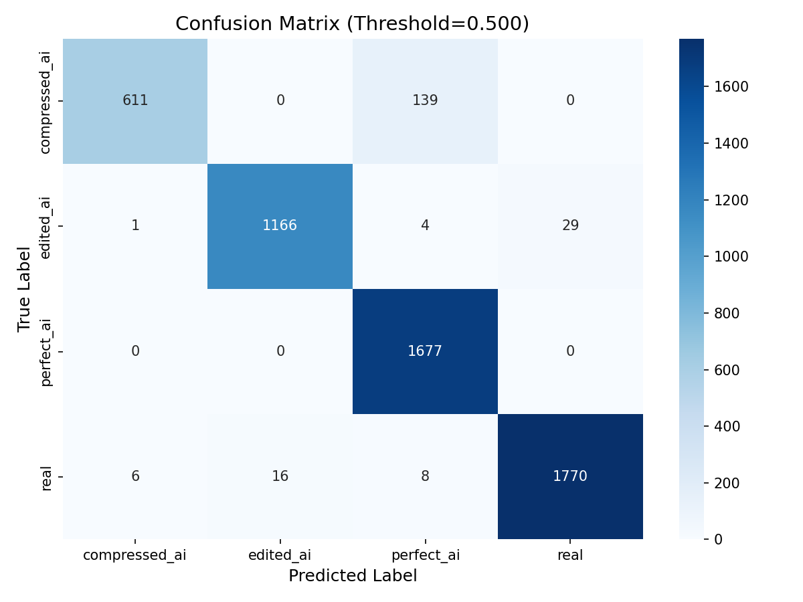

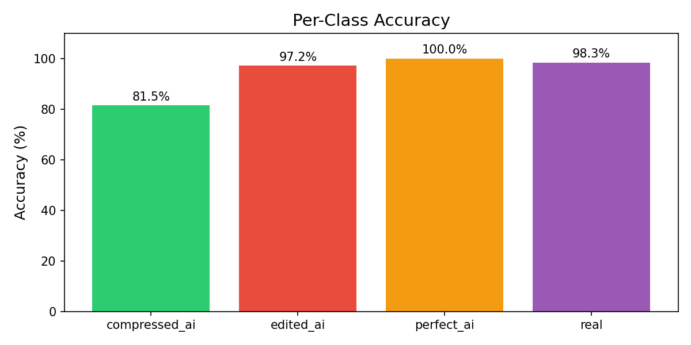

**Full Confusion Matrix** *(rows = true label, cols = predicted label)*:

| True \ Pred | compressed_ai | edited_ai | perfect_ai | real |
|---|---|---|---|---|
| **compressed_ai** | **611** | 0 | 139 | 0 |
| **edited_ai** | 1 | **1,164** | 3 | 32 |
| **perfect_ai** | 0 | 0 | **1,677** | 0 |
| **real** | 5 | 16 | 7 | **1,772** |

**Per-Class Metrics:**

| Class | Precision | Recall | F1-Score | Support |
|---|---|---|---|---|
| `compressed_ai` | 98.87% | 81.47% | 89.33% | 750 |
| `edited_ai` | 98.65% | 97.17% | 97.90% | 1,200 |
| `perfect_ai` | 91.74% | **100.00%** | 95.69% | 1,677 |
| `real` | 98.39% | 98.33% | 98.36% | 1,800 |
| **Weighted avg** | **96.46%** | **96.26%** | **96.19%** | 5,427 |

**Key Observations:**

- **`perfect_ai`** achieves **100% recall** — the model never misses a clean AI image.
- **`compressed_ai`** has the lowest recall (81.47%) — 139 images confused with `perfect_ai`. JPEG re-compression erases the high-frequency artefacts that distinguish the two classes.
- **`real`** class: only 28 out of 1,800 genuine images flagged as AI — **1.56% FPR**, well inside the ≤5% business constraint.
- The 4% train–val gap indicates mild overfitting, addressable with more `compressed_ai` training data.

---

## 6. Engineering Challenges

### 6.1 Windows Hardware Bottlenecks

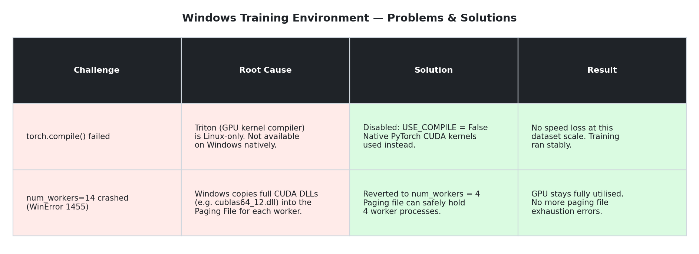

Training on Windows with an RTX 5070 Ti introduced two environment-specific obstacles:

| Challenge | Root Cause | Resolution |
|---|---|---|
| `torch.compile()` failed | Triton kernel compiler is Linux-only | Disabled `USE_COMPILE=False`; native CUDA kernels sufficient |
| `num_workers=14` crash | `WinError 1455` — Windows copies full CUDA DLLs (cublas64_12.dll etc.) into paging file per worker | Reverted to `num_workers=4`; GPU stays fully saturated |

### 6.2 Mixed Precision + Gradient Clipping

AMP halves VRAM usage by computing forward passes in `float16` and accumulating in `float32`. `float16`'s narrow dynamic range can cause gradient spikes to overflow to `inf`/`NaN`, silently corrupting training.

The fix requires a strict operation order:

```python
# Correct AMP + gradient clipping sequence:
scaler.scale(loss).backward()          # Scale loss to prevent float16 underflow
scaler.unscale_(optimizer)             # Unscale BEFORE clipping (critical order)
torch.nn.utils.clip_grad_norm_(        # Clip to max_norm=1.0
    model.parameters(), max_norm=1.0)
scaler.step(optimizer)                 # Step with safe gradients
scaler.update()                        # Adjust scale factor for next iteration
```

Calling `clip_grad_norm_` **before** `unscale_` would clip the scaled (artificially large) gradients — a subtle bug producing incorrect clipping.

---

## 7. Conclusion & Future Scope

### 7.1 Summary of Achievements

| Metric | Target | Achieved |
|---|---|---|
| Test Accuracy | > 95% | **96.26%** ✅ |
| FPR on Real (argmax) | ≤ 5% | **1.56%** ✅ |
| FPR on Real (calibrated) | ≤ 5% | **1.67%** ✅ |
| Compressed AI Recall | > 80% | **81.47%** ✅ |
| Edited AI Recall | > 90% | **97.17%** ✅ |
| Perfect AI Recall | > 90% | **100.00%** ✅ |
| Real Precision | > 95% | **98.39%** ✅ |
| Epochs to Converge | ≤ 30 | **19** (early stop) ✅ |
| Deployment Checkpoint | EMA weights | **food_ai_detector.pth** ✅ |

### 7.2 Future Deployment Architecture

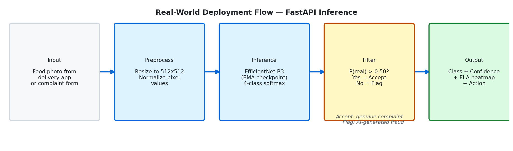

### 7.3 Roadmap

- [ ] **Dual-stream model** — parallel RGB branch + FFT frequency branch, fused at classifier head
- [ ] **Grad-CAM visualisation** — localise the exact pixel region that triggered the AI classification
- [ ] **FastAPI REST endpoint** — wrap `inference.py` for real-time integration with delivery platforms
- [ ] **WSL2 training** — enables `torch.compile()` + Triton for ~20% additional throughput
- [ ] **Model distillation** — compress to MobileNetV3 for edge deployment (mobile food-safety apps)

---

<p align="center">
  <b>FoodGuard</b> · Built with PyTorch, caffeine, and a healthy distrust of AI-generated cockroaches.<br/>
  <i>Semester VI · 2026</i>
</p>
